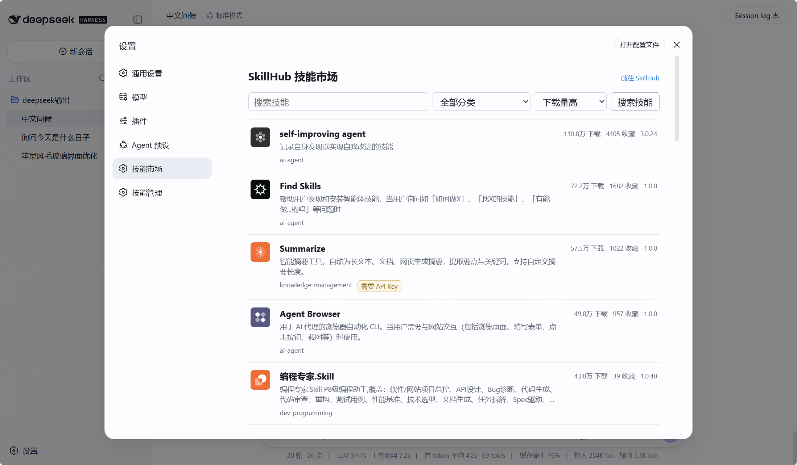
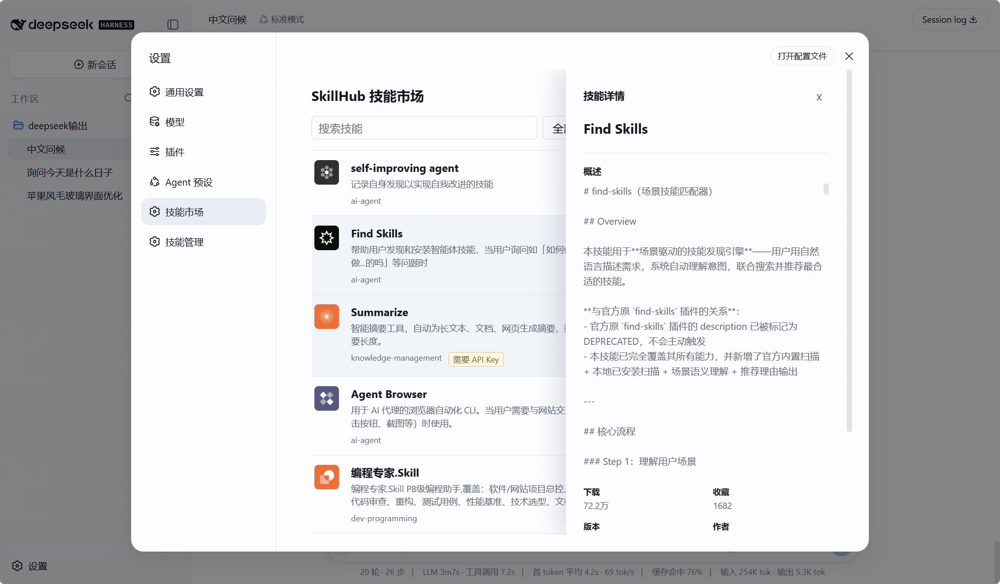

# DSH 与 SkillHub 技能市场

`dsh-withskillhub` 是 DeepSeek Harness 的独立插件。它把 SkillHub 的公开技能市场放进 DSH 网页端的“设置”侧边栏，让你不用离开 DSH 就能浏览、查看、下载、启用和更新技能。

这个插件只管理它自己下载的技能，不会改动你手工创建的 DSH 技能，也不会改动 DeepSeek Harness 本体代码。

## 你可以做什么

- 按下载量、分类或关键词浏览 SkillHub 技能。
- 点击技能查看完整概述、下载量、收藏量、版本、作者和分类。
- 一键将技能下载到本机的共享技能目录。
- 为需要 API Key 的技能直接跳转到 SkillHub 查看配置说明。
- 在“技能管理”中启用、停用、删除技能，或检查并安装最新版。
- 在下一次对话中，把已启用的本地技能提供给 AI 使用。

## 页面预览

技能市场会默认显示下载量较高的技能。你可以搜索、筛选分类，或者点击右上方的“前往 SkillHub”打开官网。



点击任意技能后，详情从右侧滑出。概述来自该技能发布包中的 `SKILL.md` 正文，而不是只有一两句简介。



## 开始前需要准备什么

1. 已经能够在本机运行 DeepSeek Harness 的网页端。
2. 已安装 Node.js 和 pnpm。
3. 已把本仓库下载到 DeepSeek Harness 仓库旁边。下面的示例目录结构是：

```text
D:\harness-lh-int8\
├─ deepseek-harness-master\
└─ dsh-withskillhub\
```

如果你的目录不同，不需要照抄盘符；只要在添加插件时把 `..\dsh-withskillhub` 改成实际路径即可。

## 第一次安装

### 第一步：下载插件代码

在 DeepSeek Harness 仓库的同级目录执行：

```powershell
git clone https://github.com/lhwu1/dsh-withskillhub.git
```

### 第二步：安装插件依赖并构建

进入插件目录后执行：

```powershell
cd D:\harness-lh-int8\dsh-withskillhub
npm install
npm run build
```

`npm install` 会下载插件需要的依赖；`npm run build` 会生成 DSH 运行插件所需的文件。

### 第三步：把插件加入 DSH 网页配置

进入 DeepSeek Harness 仓库后执行：

```powershell
cd D:\harness-lh-int8\deepseek-harness-master
pnpm dsh plugin --profile web add ..\dsh-withskillhub
```

这一步只会向 `web` 配置加入插件行，不会修改 `packages/` 中的 Harness 源码。

### 第四步：启动网页端

仍在 DeepSeek Harness 仓库中执行：

```powershell
pnpm dsh web --port 3080
```

浏览器打开 `http://127.0.0.1:3080`。进入左下角“设置”，侧边栏中应该会出现“技能市场”和“技能管理”。

## 如何使用技能市场

1. 打开 DSH 网页端，进入“设置” → “技能市场”。
2. 默认列表按下载量排序。可以在搜索框输入关键词，也可以选择分类或“最近更新”。
3. 点击一条技能记录，右侧会打开技能详情。
4. 阅读“概述”、版本、作者和统计信息；如果技能标记为“需要 API Key”，点击旁边链接到 SkillHub 获取配置说明。
5. 点击“一键装配”。下载完成后会显示已装配状态。
6. 回到正常对话并发送下一条消息。已启用的技能会在这次新请求中向 AI 开放。

技能市场只用于浏览和下载。整个远程市场列表不会直接放进 AI 的上下文，因此不会因为市场条目很多而占用对话空间。

## 如何管理已经下载的技能

打开“设置” → “技能管理”，这里会列出所有通过本插件装配的技能。

### 启用和停用

- 开关打开：技能会在下一次对话请求中提供给 AI。
- 开关关闭：技能保留在硬盘中，但不会提供给 AI。
- 重新打开开关即可恢复，不需要重新下载。

### 检测更新

点击“检测更新”后，插件会到 SkillHub 查询当前版本。

- 有新版本：自动下载并替换为最新版。
- 已是最新版：显示“已经是最新版本”。
- SkillHub 找不到该技能：显示“已下架”，但保留你本机的现有版本，方便你自行决定是否删除。

### 删除

点击“删除”会移除该技能的本地文件和安装记录。此操作不能从插件内撤销；之后仍可到技能市场重新装配。

## 技能保存在哪里

插件默认把技能保存到 DSH 的专用目录，而不是普通的用户技能目录。

未设置 `DSH_HOME` 时，Windows 默认位置是：

```text
C:\Users\你的用户名\.dsh\skillhub\skills
```

如果你设置了 `DSH_HOME` 环境变量，则位置变为：

```text
$env:DSH_HOME\skillhub\skills
```

目录大致如下：

```text
.dsh\skillhub\skills\
├─ .dsh-withskillhub.json
├─ skillhub-发布者-技能名\
│  ├─ SKILL.md
│  └─ 其他由该技能提供的文件
└─ skillhub-另一个发布者-另一个技能\
   └─ SKILL.md
```

`.dsh-withskillhub.json` 是插件的安装记录，保存技能来源、版本、安装时间和启用状态。不要手动修改它；请通过“技能管理”完成启用、停用、更新和删除。

停用技能时，插件会把该技能的入口文件 `SKILL.md` 临时改名为 `.dsh-withskillhub-disabled.md`。文件内容和附属资料都还在本机，重新启用后会自动恢复为 `SKILL.md`。

你自己放在 `C:\Users\你的用户名\.dsh\skills` 中的技能不由本插件管理，不会被删除、覆盖或混入 SkillHub 的安装记录。

## 常见问题

### 看不到“技能市场”和“技能管理”

确认第三步的添加命令执行成功，然后完全停止并重新启动 `pnpm dsh web --port 3080`。页面使用的是 `web` 配置，其他配置不会自动显示这两个入口。

### 已装配技能，但 AI 没有使用它

先到“技能管理”确认开关处于启用状态。然后新发一条消息或新开一次对话；技能列表在新的请求开始时刷新，不会回写到已经发送的消息中。

### 找不到本地技能文件

先检查是否设置过 `DSH_HOME`。没有设置时请到 `C:\Users\你的用户名\.dsh\skillhub\skills` 查找；设置过时请到 `$env:DSH_HOME\skillhub\skills` 查找。

### 技能详情里的概述显示不完整

概述由远端的 `SKILL.md` 提供。插件默认最多读取 256 KiB 并最多显示 20,000 个字符，避免超大技能文件拖慢页面；普通技能会显示完整正文。

### 技能需要 API Key，应该在哪里设置

在该技能详情中点击“前往 SkillHub 获取 API 配置”。不同技能的 API 服务商和配置方法不同，请以该技能在 SkillHub 中的说明为准。不要把 API Key 写入插件源码或提交到 Git 仓库。

## 可选配置

大多数用户不需要改配置。下面是插件可调整的参数，适合需要改变存储位置或下载限制的用户：

| 配置项 | 默认值 | 用途 |
| --- | ---: | --- |
| `apiBaseUrl` | `https://api.skillhub.cn` | SkillHub 公开接口地址。 |
| `skillsRoot` | `$DSH_HOME/skillhub/skills` | SkillHub 技能的专用存储目录。 |
| `maxFiles` | `200` | 单个技能最多允许的文件数量。 |
| `maxPackageBytes` | `26214400` | 单个技能所有文件允许的最大总大小。 |
| `requestTimeoutMs` | `15000` | 每次请求 SkillHub 的最长等待时间，单位为毫秒。 |
| `maxOverviewBytes` | `262144` | 用于详情概述的 `SKILL.md` 最大读取大小。 |
| `maxOverviewCharacters` | `20000` | 页面中最多显示的概述字符数。 |

如果修改 `skillsRoot`，还必须同时把配置中的 `dsh-withskillhub-filesystem.customSkillDirs` 改为同一个目录；否则 DSH 找不到已下载的技能。

## 更新插件代码

当你从 GitHub 拉取了新的插件代码后，在插件目录执行：

```powershell
npm install
npm run build
```

再进入 DeepSeek Harness 仓库执行：

```powershell
pnpm dsh plugin --profile web update dsh-withskillhub
```

最后完全重启网页服务：

```powershell
pnpm dsh web --port 3080
```

仅修改网页界面时，也可以在插件目录运行 `npm run dev` 进行开发时自动构建；涉及服务端路由、配置或插件包内容时，仍需要执行更新命令并重启网页服务。

## 开发者检查

修改插件后，在插件目录运行：

```powershell
npm run validate
```

该命令会依次执行类型检查、单元测试和构建。
